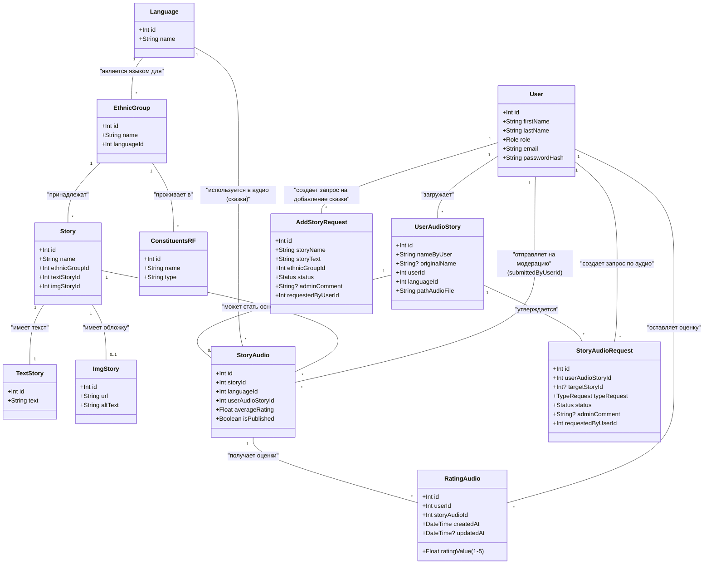
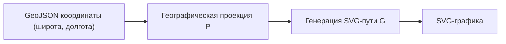
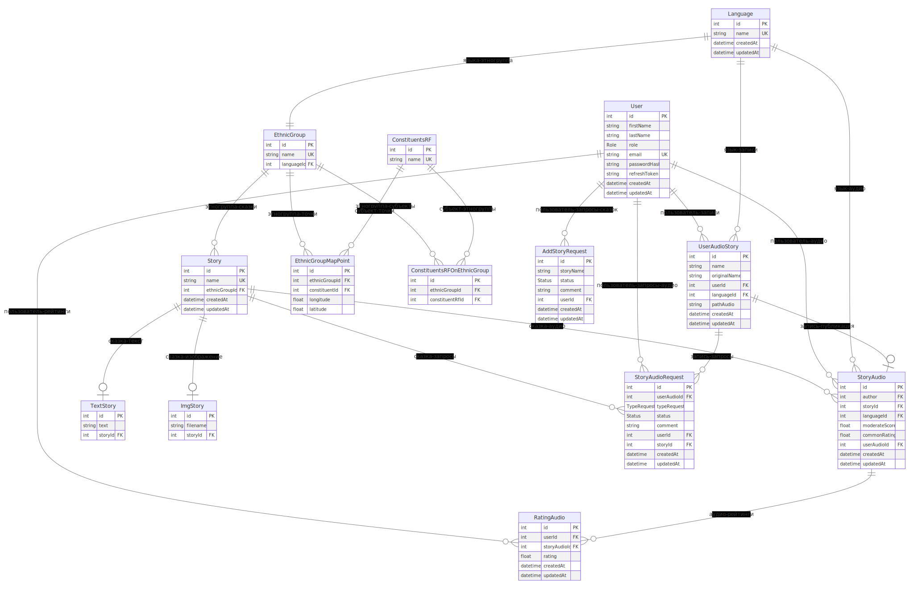
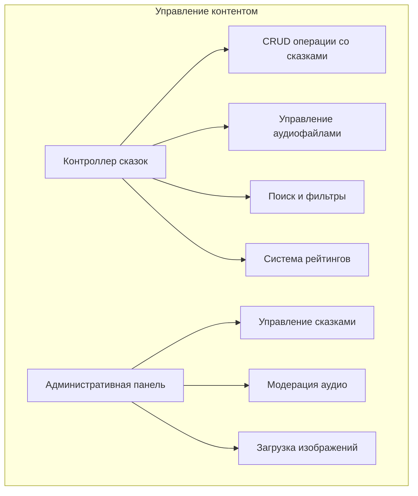
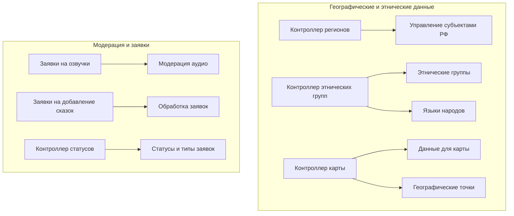

---
# You can also start simply with 'default'
theme: academic
title: сказки народов России
# apply unocss classes to the current slide
class: text-center
# https://sli.dev/features/drawing
drawings:
  persist: false
transition: slide-left
layout: intro
mdc: true
---

  
Разработка веб-приложения

"Сказки народов России"

  

    

    Подготовил:
  

    
Студент ПМИ-21: Никитин В.Е

  

---

# Цель

Целью выпускной квалификационной работы является создание веб-платформы, предоставляющую пользователям доступ к сказкам народов России через интерактивную карту, с возможностью прослушивания аудиозаписей и участия в наполнении контентом.

---

# Описание

Проект "Сказки народов России" нацелен на создание веб-приложения,которое позволит пользователям ознакомиться с культурным наследием   различных этнических групп России через сказки на их родных языках.

---

# Функиональные требования

1. Интерактивное исследование карты России:

   - Отображение карты с границами субъектов федерации.

   - Возможность выбора региона для получения детальной информации.

2. Доступ к культурному наследию:

   - Отображение информации об этнических группах, проживающих в выбранном регионе.
   - Предоставление текстов сказок на русском языке.
   - Прослушивание аудиозаписей сказок на различных языках

---

# Функциональные требования

3. Взаимодействие пользователй с веб-приложением:

   - Авторизация и создание личного кабинета.
   - Возможность загрузки собственных аудиозаписей сказок.
   - Система рейтингов для оценки аудиозаписей.
   - Поиск сказок.
   - Обратная связь с администрацией.

4. Модерация загружаемых аудиозаписей
5. Одобренный контент находится в публичном доступе.

---

# Инфологическая схема приложения

---

# GeoJSON

Данные GeoJSON — это представление точек на поверхности земного эллипсоида через угловые координаты долготы и широты в градусах. Эти координаты задают положение точки на эллипсоиде, который является стандартом WGS84 для глобальной геодезической системы координат.

---

# Преобразование GeoJSON в SVG формат

$$\text{SVG} = G(P(\text{GeoJSON})) = G \circ P (\text{GeoJSON})$$

где:
- $P$ - отображение из сферических координат на эллипсоиде Земли в плоские декартовы координаты.
  $$P: (\lambda, \varphi) \mapsto (x, y)$$
- $G$ - генератор строки SVG-пути из спроецированных координат.

$$G: \{(x_1, y_1), (x_2, y_2), ..., (x_n, y_n)\} \mapsto \text{stringPath}$$

$$\text{stringPath} = "M x_1 y_1 L x_2 y_2 ... L x_n y_n Z"$$
- $"M x y"$ — команда $\text{"moveto"}$ (перемещение к точке $(x,y)$)
- $"L x y"$ — команда $\text{P"lineto"}$ (рисование линии к точке $(x,y)$)
- $"Z"$ — команда $\text{"closepath"}$ (замыкание пути к начальной точке)

---

Для отображения карты в формате GeoJSON на двумерную плоскость $SVG$, каждая географическая координата  отображается в двумерную декартову систему координат $(x, y)$ через проекцию:

 $$(x, y) = P(\lambda, \varphi)$$

 где: 
 - $\lambda$ - долгота
 - $\phi$ - широта
 - $P$ - проекция($Mercator$, $Albers$, $Ortographic$ и д.р)

$$x = R \cdot (\lambda - \lambda_0)$$
$$y = R \cdot \ln\left(\tan\left(\frac{\pi}{4} + \frac{\varphi}{2}\right)\right)$$

---

Преобразования карты из GeoJSON формата в SVG строку происходит путём композиции функций:

---

# ERD диаграмма базы данных веб-приложения

---

# Проектирование REST API 

---

---

